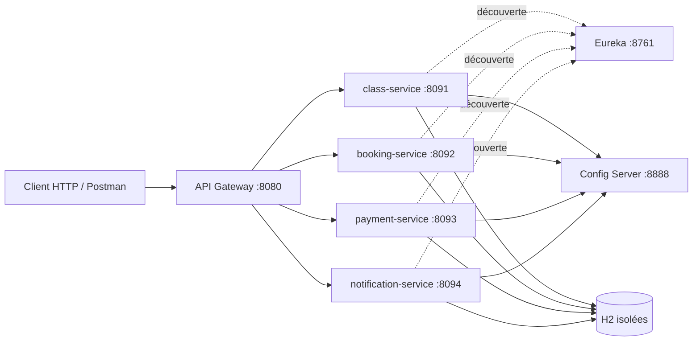
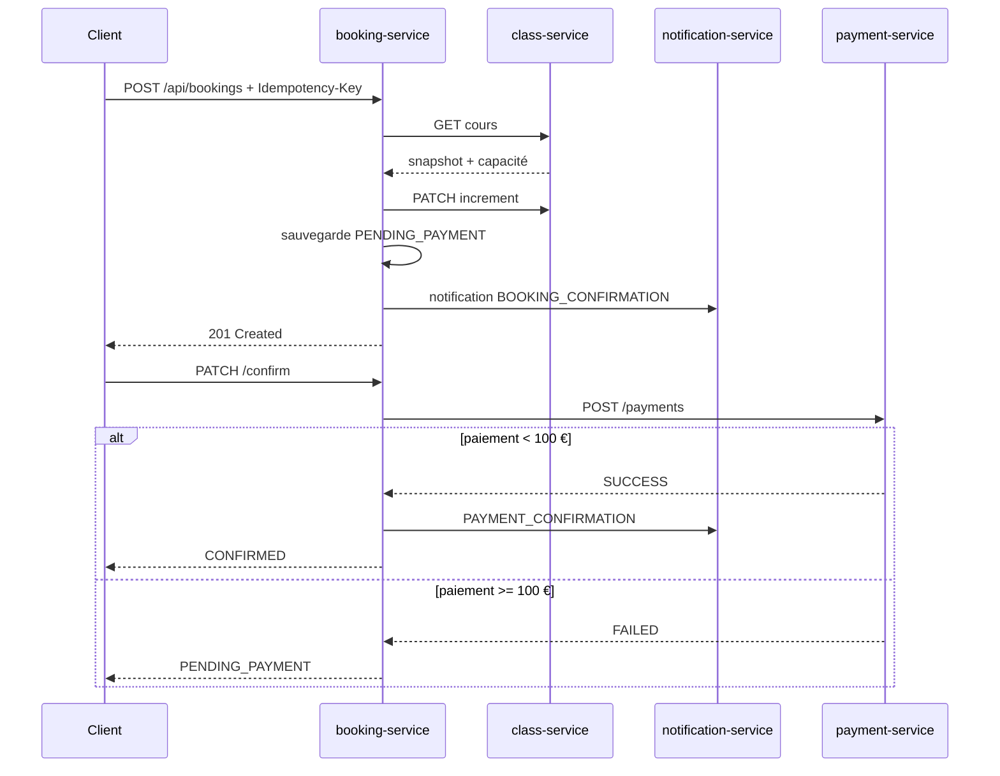
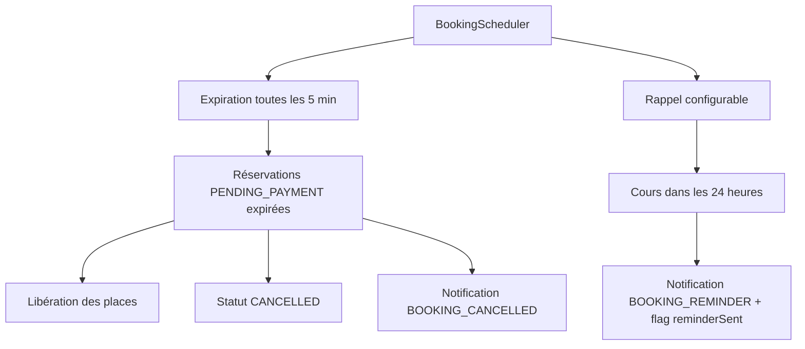

# TP FitConnect — rendu et vérification

## 1. Distinction entre le PDF et la réalisation

Le PDF `Efrie - M2-DEV1 - Microservice.pdf` fournit les consignes pédagogiques : construire une plateforme de réservation de cours de sport avec quatre services métier, puis ajouter Eureka, Config Server, une gateway, une saga de réservation, la résilience, les tâches planifiées, les tests et les livrables Docker/Postman.

Ce dépôt est la réalisation technique de ces consignes. Les choix suivants ont été fixés pour rendre le projet autonome et reproductible :

- dépôt Git séparé `fitconnect-microservices` ;
- Spring Boot `4.1.1`, Spring Cloud `2025.1.3`, Java `25` ;
- H2 en mémoire, une base logique par service ;
- dates métier en UTC ;
- paiements `< 100 €` acceptés et paiements `>= 100 €` refusés ;
- notifications persistées comme outbox simulée et envoyées dans les logs ;
- erreurs HTTP au format `ProblemDetail` RFC 9457 ;
- couverture JaCoCo bloquante à 100 % lignes et branches sur le périmètre métier.

## 2. Architecture



## 3. Démarrage

```bash
mvn clean verify
docker compose config
docker compose build
docker compose up -d
docker compose ps
```

Les interfaces utiles sont :

| Composant | URL |
|---|---|
| Gateway | `http://localhost:8080` |
| Eureka | `http://localhost:8761` |
| Config Server | `http://localhost:8888` |
| Swagger class | `http://localhost:8091/swagger-ui/index.html` |
| Swagger booking | `http://localhost:8092/swagger-ui/index.html` |
| Swagger payment | `http://localhost:8093/swagger-ui/index.html` |
| Swagger notification | `http://localhost:8094/swagger-ui/index.html` |

## 4. Contrats réalisés

### Class service

`GET /api/classes`, `GET /api/classes/{id}`, `POST /api/classes`, `PUT /api/classes/{id}`, `DELETE /api/classes/{id}`, `PATCH /api/classes/{id}/increment`, `PATCH /api/classes/{id}/decrement` et `GET /api/classes/search` sont fournis.

La suppression est logique : le cours passe à `CANCELLED`. Le champ JPA `@Version` protège les mises à jour concurrentes et le domaine refuse tout dépassement de capacité.

### Booking service

Les réservations conservent un snapshot du cours et de l’utilisateur. `Idempotency-Key` est obligatoire à la création ; une nouvelle requête avec la même clé retourne la réservation existante. `numberOfSpots` est validé entre 1 et 4.

Le statut suit le cycle `PENDING_PAYMENT -> CONFIRMED -> COMPLETED` ou `CANCELLED`. Une annulation confirmée appelle le remboursement puis libère les places. Une annulation à moins de 24 heures du cours est rejetée.

### Payment service

`POST /api/payments`, `GET /api/payments/booking/{bookingId}`, `POST /api/payments/{id}/refund` et `GET /api/payments/user/{userId}` sont fournis. Le paiement refusé reste `FAILED` et la réservation appelante reste `PENDING_PAYMENT`.

### Notification service

Les notifications sont créées en `PENDING`, l’envoi simulé les passe en `SENT` et les erreurs peuvent être rejouées avec `PATCH /api/notifications/{id}/retry`. Les rappels sont déclenchés dans les 24 heures avant le cours.

## 5. Saga de réservation



Si une dépendance Feign est indisponible, le service renvoie un `ProblemDetail` `503 Service Unavailable` et ne fabrique aucune donnée de substitution. Les erreurs métier de capacité ou de délai renvoient `409 Conflict`.

## 6. Tâches planifiées



Les délais sont configurables par `fitconnect.scheduler.expiration-delay` et `fitconnect.scheduler.reminder-delay`. La `Clock` est injectée dans le service de réservation, ce qui permet des tests déterministes en UTC.

## 7. Tests et couverture

Les tests couvrent les règles métier nominales et d’erreur : capacité, verrouillage optimiste du domaine, idempotence, paiement accepté/refusé, expiration, annulation, remboursement, notifications, retries, rappels et indisponibilité Feign.

Commandes de contrôle :

```bash
mvn clean verify
find . -path '*/target/site/jacoco/jacoco.xml' -print
jq empty postman/fitconnect.postman_collection.json
docker compose config -q
```

Le seuil JaCoCo est configuré à `LINE=100 %` et `BRANCH=100 %` pour les classes métier et services. Les contrôleurs, DTO, repositories et classes de bootstrap sont des adaptateurs d’infrastructure exclus de ce périmètre ; ils sont vérifiables via Swagger, Postman et les tests d’intégration à ajouter lors d’un déploiement réel.

## 8. Scénarios Postman

La collection `postman/fitconnect.postman_collection.json` contient :

1. création et recherche d’un cours ;
2. réservation idempotente ;
3. confirmation d’un paiement accepté ;
4. annulation et remboursement ;
5. paiement refusé ;
6. capacité insuffisante ;
7. paiement expiré ;
8. annulation hors délai.

Les URLs de la collection utilisent `{{baseUrl}}`, configuré par défaut sur `http://localhost:8080`.

## 9. Limites documentées

- La stack est autonome et ne modifie pas `bibliotheque-microservices`.
- H2 est adaptée au TP, mais une base externe et une migration seraient nécessaires en production.
- Le paiement est une simulation déterministe ; aucun prestataire bancaire réel n’est appelé.
- L’outbox est persistée dans H2 et l’envoi est simulé par logs ; un broker ou un worker serait nécessaire pour une livraison asynchrone réelle.
- Le circuit breaker est activé par la dépendance Resilience4j et les appels Feign échoués sont traduits en erreur explicite ; les données de fallback restent volontairement absentes.
